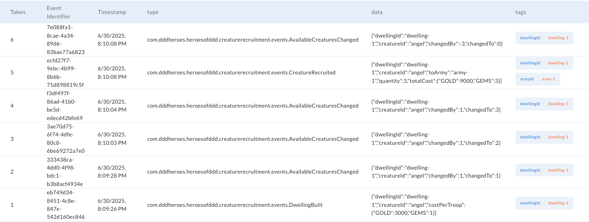

# Heroes of Domain-Driven Design (Java)
Shows how to use Domain-Driven Design, Event Storming, Event Modeling and Event Sourcing in Heroes of Might & Magic III domain.

👉 See also implementations in: 
- [Java + Axon Framework 4](https://github.com/MateuszNaKodach/HeroesOfDomainDrivenDesign.EventSourcing.Java.Axon.Spring)
- [TypeScript + Emmett](https://github.com/MateuszNaKodach/HeroesOfDomainDrivenDesign.EventSourcing.TypeScript.Emmett.Express)
- [Ruby + RailsEventStore](https://github.com/MateuszNaKodach/HeroesOfDomainDrivenDesign.EventSourcing.Ruby)

👉 [Let's explore the Heroes of Domain-Driven Design blogpost series](https://dddheroes.com/)
- There you will get familiar with the whole Software Development process: from knowledge crunching with domain experts, designing solution using Event Modeling, to implementation using DDD Building Blocks.

This project probably won't be a fully functional HOMM3 engine implementation because it's done for educational purposes.
If you'd like to talk with me about mentioned development practices, feel free to contact on [linkedin.com/in/mateusznakodach/](https://www.linkedin.com/in/mateusznakodach).

I'm focused on domain modeling on the backend, but I'm going to implement UI like below in the future.


## 🚀 How to run the project locally?

0. Install Java (at least version 21) on your machine
1. `./mvnw install -DskipTests`
2. `docker compose up`
3. Create Axon Server Context (details below)
3. `./mvnw spring-boot:run` or `./mvnw test`

### Create Axon Server Context

- Open the Axon Server UI at [http://localhost:8024](http://localhost:8024)
- Go to: Event Store → Contexts
- Click "Create Context"
- Fill out details:
  - Name: `heroesofddd`
  - Replication group: Create new 
  - Replication group name: `heroesofddd`
  - Nodes: `axon-server`
  - Role for axon-server: `PRIMARY'
  - DCB context (beta): checked!!! — this is essential for the DCB support

If you did not create the DCB context, the command execution will fail with the following error:
```
org.axonframework.commandhandling.CommandExecutionException: Exception while handling command
Caused by: java.util.concurrent.ExecutionException: io.grpc.StatusRuntimeException: UNAVAILABLE
```

Thanks to that, you will be able to browse stored events in the Axon Server UI and see the attached tags to each of them.


## 🧱 Modules

Modules (mostly designed using Bounded Context heuristic) are designed and documented on EventModeling below.
Each slice in a module is in certain color which shows the progress:
- green -> completed
- yellow -> implementation in progress
- red -> to do
- grey -> design in progress

List of modules you can see in package `com.dddheroes.heroesofddd`.
```
heroesofddd/
├── armies
├── astrologers
├── calendar
├── creature_recruitment
```

Each domain-focused module follows Vertical-Slice Architecture of three possible types: write, read and automation following Event Modeling nomenclature.


### 👾 Creature Recruitment


Slices:
- Write: [BuildDwelling -> DwellingBuilt](src/main/kotlin/com/dddheroes/heroesofddd/creaturerecruitment/write/builddwelling/BuildDwelling.Slice.kt) | [test](src/test/kotlin/com/dddheroes/heroesofddd/creaturerecruitment/write/builddwelling/BuildDwellingUnitTest.kt)
- Write: [IncreaseAvailableCreatures -> AvailableCreaturesChanged](src/main/kotlin/com/dddheroes/heroesofddd/creaturerecruitment/write/increaseavailablecreatures/IncreaseAvailableCreatures.Slice.kt) | [test](src/test/kotlin/com/dddheroes/heroesofddd/creaturerecruitment/write/increaseavailablecreatures/IncreaseAvailableCreaturesUnitTest.kt)
- Write: [RecruitCreature -> CreatureRecruited](src/main/kotlin/com/dddheroes/heroesofddd/creaturerecruitment/write/recruitcreature/RecruitCreature.Slice.kt) | [test](src/test/kotlin/com/dddheroes/heroesofddd/creaturerecruitment/write/recruitcreature/RecruitCreatureUnitTest.kt)
- Read - TO BE IMPLEMENTED
- Automation - TO BE IMPLEMENTED
