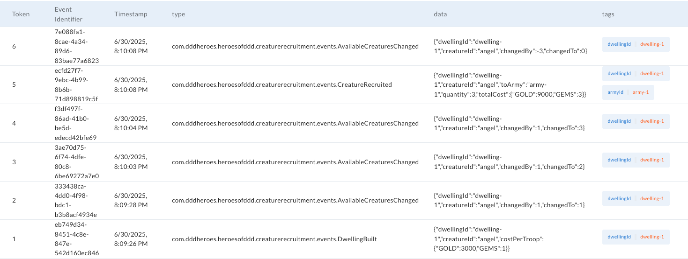
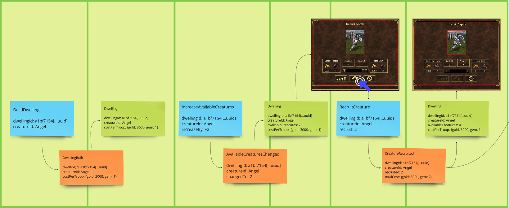
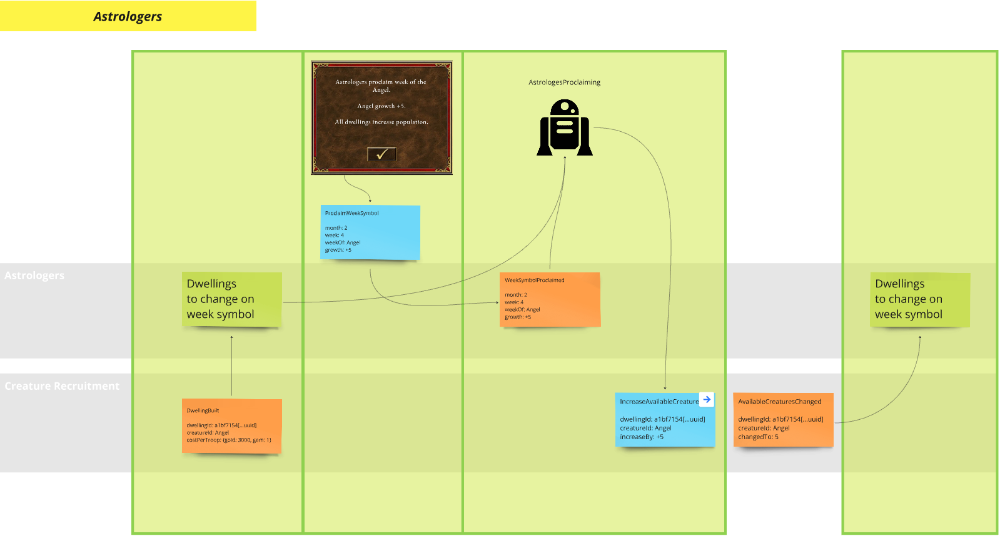
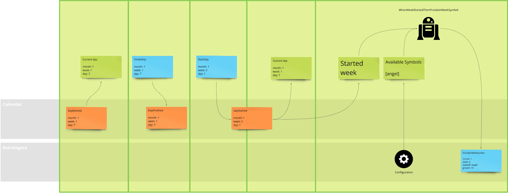
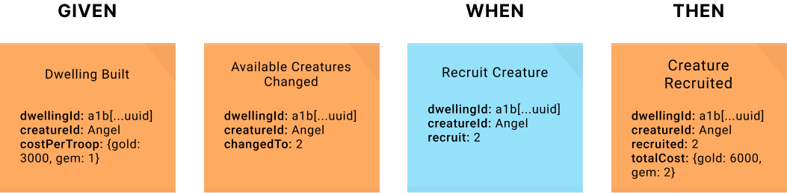

# Heroes of Domain-Driven Design (Kotlin + Axon Framework 5)

Shows how to use Domain-Driven Design, Event Storming, Event Modeling and Event Sourcing (with Dynamic Consistency
Boundary) in Heroes of Might & Magic III domain.

👉 See also implementations in:
- [Java + Axon Framework 4](https://github.com/MateuszNaKodach/HeroesOfDomainDrivenDesign.EventSourcing.Java.Axon.Spring)
- [TypeScript + Emmett](https://github.com/MateuszNaKodach/HeroesOfDomainDrivenDesign.EventSourcing.TypeScript.Emmett.Express)
- [Ruby + RailsEventStore](https://github.com/MateuszNaKodach/HeroesOfDomainDrivenDesign.EventSourcing.Ruby)

👉 [Let's explore the Heroes of Domain-Driven Design blogpost series](https://dddheroes.com/)
- There you will get familiar with the whole Software Development process: from knowledge crunching with domain experts, designing solution using Event Modeling, to implementation using DDD Building Blocks.

This project probably won't be a fully functional HOMM3 engine implementation because it's done for educational purposes.
If you'd like to talk with me about mentioned development practices, feel free to contact on [linkedin.com/in/mateusznakodach/](https://www.linkedin.com/in/mateusznakodach).

## ⚔️ [Business Domain](DOMAIN_OVERVIEW.md)

Heroes III is not "just a game" — it's a rich, well-documented business domain where every mechanic maps to real-world patterns: creature recruitment is e-commerce with limited stock, resource management is budget allocation, weekly growth cycles are scheduled inventory replenishment. The [Domain Overview](DOMAIN_OVERVIEW.md) explains why this domain was chosen over typical examples like cinemas or shopping carts, how game mechanics translate to enterprise business processes, and how the modular architecture enables scenarios beyond the original game (real-time multiplayer, async gameplay, new products from existing modules).

I'm focused on domain modeling on the backend, but I'm going to implement UI like below in the future.


## 🚀 How to run the project locally?

0. Install Java (at least version 21) on your machine
1. `./mvnw install -DskipTests`
2. `docker compose up`
3. Create Axon Server Context (details below)
3. `./mvnw spring-boot:run` or `./mvnw test`

### Create Axon Server Context

- Open the Axon Server UI at [http://localhost:8024](http://localhost:8024)
- The default DCB context should be created automatically.

If you did not create the DCB context, the command execution will fail with the following error:
```
org.axonframework.commandhandling.CommandExecutionException: Exception while handling command
Caused by: java.util.concurrent.ExecutionException: io.grpc.StatusRuntimeException: UNAVAILABLE
```

Thanks to that, you will be able to browse stored events in the Axon Server UI and see the attached tags to each of them.


## 🌐 Interacting with the Application

You can interact with the system in two ways:

### REST API

Access the REST API documentation
at: [http://localhost:3775/swagger-ui/index.html](http://localhost:3775/swagger-ui/index.html)

## 🏛️ Screaming Architecture

The project follows a Screaming Architecture pattern organized around vertical slices that mirror Event Modeling
concepts.

The package structure screams the capabilities of the system by making explicit: commands available to users, events
that capture what happened, queries for retrieving information, business rules, and system automations.
This architecture makes it immediately obvious what the system can do, what rules govern those actions, and how
different parts of the system interact through events.

Each module is structured into three distinct types of slices (packages `write`, `read`, `automation`) and there are
events (package `events`) between them, which are a system backbone — a contract between all other parts:

```
creaturerecruitment/                     ← Bounded Context
├── automation/                          ← Automation Slices
│   └── WhenCreatureRecruited...         ← Event → Command reactor
├── events/                              ← Events — contract between slices
│   ├── AvailableCreaturesChanged        ← Event (state change fact)
│   ├── CreatureRecruited                ← Event (command result)
│   ├── DwellingBuilt                    ← Event
│   └── DwellingEvent                    ← Sealed interface (all events in BC)
├── read/                                ← Read Slices
│   ├── getalldwellings/                 ← Query
│   │   └── GetAllDwellings.Slice.kt     ← Projector + QueryHandler + REST
│   └── getdwellingbyid/                 ← Query
│       └── GetDwellingById.Slice.kt
└── write/                               ← Write Slices
    ├── builddwelling/                   ← Command
    │   └── BuildDwelling.Slice.kt       ← decide() + evolve() + Handler + REST
    ├── increaseavailablecreatures/
    │   └── IncreaseAvailableCreatures.Slice.kt
    └── recruitcreature/
        └── RecruitCreature.Slice.kt     ← DCB: multi-tag consistency boundary
```

## 🍰 Vertical Slices

In this project, **Event Modeling** guidelines are implemented through a **Vertical Slice Architecture** using **Axon Framework 5** and **Kotlin**. Each feature is organized into a self-contained "slice" (typically a single file named `FeatureName.Slice.kt`) following these core principles:

### 1. Write Slices (Command → Event → State)

Contains commands that represent user intentions, defines business rules through pure `decide()` and `evolve()`
functions (no traditional Aggregates), produces domain events, and enforces invariants (e.g., `RecruitCreature`
command → `CreatureRecruited` event).

*   **Pattern:** `Command` (Blue) triggers a `decide()` function, which produces `Events` (Orange). These events are then used by an `evolve()` function to reconstruct the `State` (Green).
*   **Pure Functions:** `decide(command, state)` handles business logic and validation, while `evolve(state, event)` handles state transitions. Both are side-effect-free.
* **Consistency Boundaries:** Defined using **Event Tags** (e.g., `DWELLING_ID`). The `@EventSourced` entity manages
  these boundaries. There are no traditional Aggregates — consistency is defined by event tags and Dynamic Consistency
  Boundaries (DCB).
* **Testing:** Verified using tests with the `AxonTestFixture` DSL (
  `Given { events } When { command } Then { expectedEvents }`).

### 2. Read Slices (Event → Read Model → Query)

Implements queries and read models optimized for specific use cases, with projectors that transform events into
queryable state (e.g., `GetDwellingById` query → `DwellingReadModel`).

*   **Pattern:** `Events` (Orange) are handled by a **Projector** that updates a **Read Model** (Green, typically a JPA entity). A **Query Handler** then retrieves data from this model.
*   **Testing:** Integration tests ensure that publishing events correctly updates the read model and that queries return the expected data.

### 3. Automation Slices (Event → Command)

Processes events to trigger subsequent actions, implementing system policies and workflows that connect different
modules (e.g., `WhenCreatureRecruitedThenAddToArmy`).

*   **Pattern:** An `Event` (Orange) triggers a **Processor** that dispatches a new `Command` (Blue).
*   **Types:**
    *   **Stateless:** Direct mapping from event data to a command.
    *   **With Read Model:** Uses a private, slice-specific read model to look up data needed to construct the command.
*   **Dispatching:** Uses `CommandDispatcher` (method-injected) to ensure proper coordination within the message processing context.

## 🧱 Modules

Modules (mostly designed using Bounded Context heuristic) are designed and documented on Event Modeling below.
Each slice in a module is in certain color which shows the progress:

- green → completed
- yellow → implementation in progress
- red → to do
- grey → design in progress

List of modules you can see in package `com.dddheroes.heroesofddd`.
```
heroesofddd/
├── armies
├── astrologers
├── calendar
├── creaturerecruitment
├── resourcespool
└── shared
```

Each domain-focused module follows Vertical-Slice Architecture of three possible types: write, read and automation following Event Modeling nomenclature.

### 👾 Creature Recruitment



Slices:
- Write: [BuildDwelling → DwellingBuilt](src/main/kotlin/com/dddheroes/heroesofddd/creaturerecruitment/write/builddwelling/BuildDwelling.Slice.kt) | [test](src/test/kotlin/com/dddheroes/heroesofddd/creaturerecruitment/write/builddwelling/BuildDwellingSpringSliceTest.kt) | [REST test](src/test/kotlin/com/dddheroes/heroesofddd/creaturerecruitment/write/builddwelling/BuildDwellingRestApiTest.kt)
- Write: [IncreaseAvailableCreatures → AvailableCreaturesChanged](src/main/kotlin/com/dddheroes/heroesofddd/creaturerecruitment/write/increaseavailablecreatures/IncreaseAvailableCreatures.Slice.kt) | [test](src/test/kotlin/com/dddheroes/heroesofddd/creaturerecruitment/write/increaseavailablecreatures/IncreaseAvailableCreaturesSpringSliceTest.kt)
- Write: [RecruitCreature → CreatureRecruited, CreatureAddedToArmy, AvailableCreaturesChanged](src/main/kotlin/com/dddheroes/heroesofddd/creaturerecruitment/write/recruitcreature/RecruitCreature.Slice.kt) | [unit test](src/test/kotlin/com/dddheroes/heroesofddd/creaturerecruitment/write/recruitcreature/RecruitCreatureUnitTest.kt) | [spring test](src/test/kotlin/com/dddheroes/heroesofddd/creaturerecruitment/write/recruitcreature/RecruitCreatureSpringSliceTest.kt)
- Read: [(DwellingBuilt, AvailableCreaturesChanged) → GetAllDwellings](src/main/kotlin/com/dddheroes/heroesofddd/creaturerecruitment/read/getalldwellings/GetAllDwellings.Slice.kt) | [test](src/test/kotlin/com/dddheroes/heroesofddd/creaturerecruitment/read/getalldwellings/GetAllDwellingsSpringSliceTest.kt)
- Read: [GetDwellingById (inline event-sourced projection)](src/main/kotlin/com/dddheroes/heroesofddd/creaturerecruitment/read/getdwellingbyid/GetDwellingById.Slice.kt) | [test](src/test/kotlin/com/dddheroes/heroesofddd/creaturerecruitment/read/getdwellingbyid/GetDwellingByIdSpringSliceTest.kt)

### 🧙 Astrologers



Slices:
- Write: [ProclaimWeekSymbol → WeekSymbolProclaimed](src/main/kotlin/com/dddheroes/heroesofddd/astrologers/write/proclaimweeksymbol/ProclaimWeekSymbol.Slice.kt) | [test](src/test/kotlin/com/dddheroes/heroesofddd/astrologers/write/proclaimweeksymbol/ProclaimWeekSymbolSpringSliceTest.kt)
- Read: [(WeekSymbolProclaimed) → GetWeekSymbol](src/main/kotlin/com/dddheroes/heroesofddd/astrologers/read/getweeksymbol/GetWeekSymbol.Slice.kt) | [test](src/test/kotlin/com/dddheroes/heroesofddd/astrologers/read/getweeksymbol/GetWeekSymbolSpringSliceTest.kt) | [REST test](src/test/kotlin/com/dddheroes/heroesofddd/astrologers/read/getweeksymbol/GetWeekSymbolRestApiTest.kt)
- Automation: [DayStarted (where day==1) → ProclaimWeekSymbol](src/main/kotlin/com/dddheroes/heroesofddd/astrologers/automation/whenweekstartedthenproclaimweeksymbol/WhenWeekStartedThenProclaimWeekSymbol.Slice.kt) | [test](src/test/kotlin/com/dddheroes/heroesofddd/astrologers/automation/whenweekstartedthenproclaimweeksymbol/WhenWeekStartedThenProclaimWeekSymbolSpringSliceTest.kt)
- Automation: [(WeekSymbolProclaimed, DwellingBuilt) → IncreaseAvailableCreatures for each matching dwelling](src/main/kotlin/com/dddheroes/heroesofddd/astrologers/automation/whenweeksymbolproclaimedthenincreasedwellingavailablecreatures/WhenWeekSymbolProclaimedThenIncreaseDwellingAvailableCreatures.Slice.kt) | [test](src/test/kotlin/com/dddheroes/heroesofddd/astrologers/automation/whenweeksymbolproclaimedthenincreasedwellingavailablecreatures/WhenWeekSymbolProclaimedThenIncreaseDwellingAvailableCreaturesSpringSliceTest.kt)

### 📅 Calendar



Slices:
- Write: [StartDay → DayStarted](src/main/kotlin/com/dddheroes/heroesofddd/calendar/write/startday/StartDay.Slice.kt) | [test](src/test/kotlin/com/dddheroes/heroesofddd/calendar/write/startday/StartDaySpringSliceTest.kt) | [REST test](src/test/kotlin/com/dddheroes/heroesofddd/calendar/write/startday/StartDayRestApiTest.kt)
- Write: [FinishDay → DayFinished](src/main/kotlin/com/dddheroes/heroesofddd/calendar/write/finishday/FinishDay.Slice.kt) | [test](src/test/kotlin/com/dddheroes/heroesofddd/calendar/write/finishday/FinishDaySpringSliceTest.kt) | [REST test](src/test/kotlin/com/dddheroes/heroesofddd/calendar/write/finishday/FinishDayRestApiTest.kt)
- Read: [(DayStarted, DayFinished) → GetCurrentDay](src/main/kotlin/com/dddheroes/heroesofddd/calendar/read/getcurrentday/GetCurrentDay.Slice.kt) | [test](src/test/kotlin/com/dddheroes/heroesofddd/calendar/read/getcurrentday/GetCurrentDaySpringSliceTest.kt) | [REST test](src/test/kotlin/com/dddheroes/heroesofddd/calendar/read/getcurrentday/GetCurrentDayRestApiTest.kt)

### 🎖️ Armies

Slices:
- Read: [(CreatureAddedToArmy, CreatureRemovedFromArmy) → GetArmyCreatures](src/main/kotlin/com/dddheroes/heroesofddd/armies/read/getarmycreatures/GetArmyCreatures.Slice.kt) | [test](src/test/kotlin/com/dddheroes/heroesofddd/armies/read/getarmycreatures/GetArmyCreaturesSpringSliceTest.kt) | [REST test](src/test/kotlin/com/dddheroes/heroesofddd/armies/read/getarmycreatures/GetArmyCreaturesRestApiTest.kt)

## 🧪 Testing

Tests use Axon Server with Testcontainers (real event store, not in-memory), following the approach:

- **write slice**: `given(events) → when(command) → then(events)`
- **read slice**: `given(events) → then(read model)`
- **automation**: `given(events) → then(dispatched commands)`

Tests are focused on observable behavior — there are no Aggregates to test, only pure `decide()` and `evolve()`
functions exercised through the `AxonTestFixture` DSL. The domain model can be refactored without changes in tests.

### Example: write slice test



```kotlin
internal class RecruitCreatureSpringSliceTest @Autowired constructor(
    private val sliceUnderTest: AxonTestFixture
) {

    @Test
    fun `given dwelling with 2 creatures, when recruit 2 creatures, then recruited`() {
        val dwellingId = DwellingId.random()
        val armyId = ArmyId.random()
        val creatureId = CreatureId("angel")

        sliceUnderTest.Scenario {
            Given {
                event(DwellingBuilt(dwellingId, creatureId, costPerTroop))
                event(AvailableCreaturesChanged(dwellingId, creatureId, changedBy = 2, changedTo = Quantity(2)))
            } When {
                command(
                    RecruitCreature(
                        dwellingId = dwellingId,
                        creatureId = creatureId,
                        armyId = armyId,
                        quantity = Quantity(2),
                    )
                )
            } Then {
                events(
                    CreatureRecruited(
                        dwellingId = dwellingId,
                        creatureId = creatureId,
                        toArmy = armyId,
                        quantity = Quantity(2),
                        totalCost = Resources.of(ResourceType.GOLD to 6000, ResourceType.GEMS to 2)
                    )
                )
            }
        }
    }
}
```

### 💼 Hire me

If you'd like to hire me for Domain-Driven Design and/or Event Sourcing projects I'm available to work with:
Kotlin, Java, C# .NET, Ruby and JavaScript/TypeScript (Node.js or React).
Please reach me out on LinkedIn [linkedin.com/in/mateusznakodach/](https://www.linkedin.com/in/mateusznakodach/).
